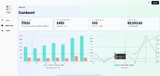

# Data Visualization Dashboard


## Project Overview
The Logic Game dashboard is a responsive data visualization dashboard designed to present players' data from the database using interactive charts. It helps users understand player behaviors and manage subscriptions through forms.

## Contents

### Login
- **Admin Login**: Provides secure access to the dashboard.

### Dashboard
- **Overview**: Displays the total number of players and subscriptions.
- **Interactive Charts**: Offers a comprehensive view of monthly player and subscription statistics, keeping users well-informed.

### Subscriptions
- **Subscription List**: Showcases a list of subscriptions.
- **Search Functionality**: Allows users to search for specific subscriptions by name.

### Players
- **Player List**: Displays a list of players.
- **Search Functionality**: Enables users to search for specific players by name.

### Light Mode and Dark Mode
- **Theme Selection**: Users can switch between dark mode and light mode based on their preferences and the surrounding circumstances.

## How to Install and Run the Project

```
npm run dev
```